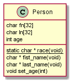
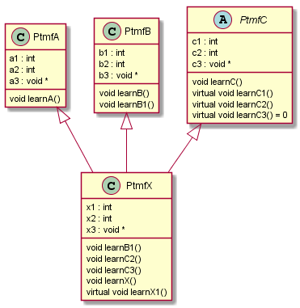
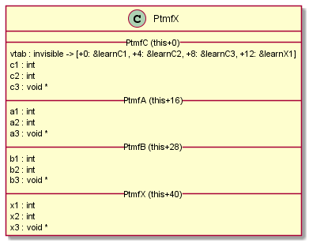

# C++ Pointer to Member Function

A challenge for every C++ programmer are pointer to member functions (*ptmf*). *ptmf*s are diffent than their C counterparts - function pointers (*fp*).
Using function pointers in C is a common practice and gives the programmer a powerful technique for a good pice of software. When used correctly, *fp*s can help to:
- improve software's performance
- lead to modulare and reusable components

Function pointers can also be used in C++. However *fp*s can only be used to point to static class functions. *fp*s can't be used to point to member functions, as a member function must be always called in combination with a object instance.



Using a function pointer to point to `char * Person::race(void)` is possible, as this is a static function, that can be called without an instance of `Person` (*race* of any person is "human" - therfore no *Person* instance is neccessary).
```
char * (*getRace)(void) = &Person::race;
```

However a function pointer can't be used to point to `char * Person::first_name(void)` or  `char * Person::first_last(void)` as a *Person* instance is required to get the name of the respective persion. This is where a C++ pointer to member function *ptmf* comes into play.

See also my notes in [lambda.md](lambda.md) to see how  *fp*s and *ptmf*s are used in combination with **C++ lambdas**.


## Comparison *fp*s and *ptmf*s
*fp*s and *ptmf*s are diffrent, as they are ma for different techniques/languages. *fp*s are made for C, *ptmf* are made for C++.

### *fp*s
- A *fp* stores the address of a function
- The *fp*s type defines the function signature (of the *fp*)

To make life easier it is recommended to use *typedef*s, to define an explicit type for the *fp*:
__Detailed:__
```
typedef char * (*GetRace_t)(void); //typedef
GetRace_t getRace; //definition
getRace = &Person::race; //assignmet
char * race = getRace(); //invocation
```

However, that is not mandatory, you can also do it like this:
__Brief:__
```
char * (*getRace)(void) = &Person::race; //defintion (without an explicit typedef) and assignment
```


### *ptmf*s
- A *ptmf* stores either the address of a non-virtual function or a vtable offset to a virtual function
- A *ptmf* stores the rules to modify the instance pointer (for the implicit type conversion required when *inheritance* comes into play)
- A *ptmf* stores the information whether the ptmf points to a virtual or a non-virtual function
- A *ptmf*s type defines the function signature (of the *ptmf*)
- A *ptmf*s type defines the class they ptmf is related to

To make life easier it is recommended to use *typedef*s, to define an explicit type for the *ptmf*:
__Detailed:__
```
typedef char * (Person::*GetName_t)(void); //typedef (with class specifier!)
GetName_t getName; //definition
getName = &Person::last_name; //assinment
char * name = (manuel->*getName)(); //invoation (in combination with *Person* instance pointer "manuel")
```

However, that is not mandatory, you can also do it like this:
__Brief:__
```
char * (Person::*getName)(void) = &Person::last_name; //defintion (without an explicit typedef) and assignment
```

The syntax to invoce a *ptmf* is:
- `.*` for the case the left hand side is an object reference
- `->*` for the case the left hand side is an object pointer

The parentheses around `obj.*ptmf` resp. `obj->*ptmf` are mandatory. E.g. `(manuel->*getName)();` works, but `manuel->*getName();` fails!


## How *ptmf*s work
To figure out, how *ptmf*s work, lets introduce the following example:



We have four classes: Class `PtmfX` uses (multiple) inheritance to derive from class `PtmfA`, `PtmfB` and `PtmfC`. So `PtmfX` is composed out of the data attribues of `PtmfA`, `PtmfB`, `PtmfC` and its own data. This can be illustrated like this:



`PtmfX` starts with the data of `PtmfC`, followed by `PtmfA`, follwoed by `PtmfB` and finally by its own data. So the `PtmfC` data has an offset of `PtmfX`s **this + 0**. `PtmfA` has an offset of **this + 16** and `PtmfC` has an offset of **this + 28**. `PtmfX`s own data starts at offset **this + 40**. Thus the following type conversion / upcasting rules apply (here: x is pointer to PtmfX)
- PtmfX pointer to PtmfA pointer: *this* + 16
- PtmfX pointer to PtmfB pointer: *this* + 28
- PtmfX pointer to PtmfC pointer: *this* + 0

`PtmfX` has also derived all the functions of the base classes. That means `PtmfX` will (re-)use the derived functions as they are defined in the respective base class. There will be no extra copy of those functions for `PtmfX`. That's important to know (for the following discussion). Just to clairfy that: `PtmfX::learnA` is just an alias for `PtmfA::learnA`. It is **the same** function!!!

Also important to consider is that in C++ virtual functions can be overwritten by derived classed. In this example `PtmfX` overwrites the virtual function `PtmfC::learnC2` with its own implementation `PtmfX:learnC2`.


### Direct member function invocation

__Scenario 1:__
Before we start the discussion how a *ptmf* is used to invoce a member function, lets have a look how a "normal" C++ non-virtual member function invocation works.

```
PtmfX * x = new PtmfX();
...
x->learnA();
```

Here we are using a `PtmfX` instance pointer (*x*) to call member function `learnA` which was derived from `PtmfA`. The signature of `learnA` looks like that:

```
void PtmfA::learnA();
```

Imporant to mention at this point, is that `learnA` belongs to class `PtmfA`. So within this function, it is expected, that *this* points to a `PtmfA` instance.
However, we are calling that function using a `PtmfX` pointer (*x*). Therefore on invocation, x must be upcasted to an `PtmfA *` before the CPU can jump to the address of the function `learnA`. This is all done automatically by the compile, as the compile knows, that the function belongs to `PtmfA` and the instance pointer is of type `PtmfX`. Furthermore it knows the address of function `learnA`.


__Scenario 2:__
If we are calling virtual function, the code looks almost the same:

```
PtmfX * x = new PtmfX();
...
x->learnC2();
```

Under the hood the compiler has to do some different things. The implicit type conversion mentiont above has to be done exactly the same way. However the process of getting the address of `learnC2` is different. As `learnC2` is a virtual function, its destination function function address isn't fix. it depends on the object used on invocation. In this example, we call `learnC2` with an `PtmfX` instance, so we expect, that `PtmfX::learnC2` is called. When calling `learn"` with a differen object - for example with an `PtmfWhatever` we expect that `PtmfWhatever::learnC2` is called (in the case `PtmfWhatever` has defined its own implmentation of `learn2`).
Therefore getting the address of the right `learnC2` function means, accessing the vtable of the object used on invocation, to read out the destination address. The the CPU can jump to that address. Also in this case, everything is done automatically by the compiler, as it has all the required information, to generate the correct code to do the right stuff.


### Indirect member function invocation using a *ptmf*
The same stuff which is done when calling a member function directly must happen when the the member function is called indirectly by the *ptmf*. It must deal with both scenarios mentioned above.

The assignment of a member function to a *ptmf* and the later incovation of the *ptmf* to call the assigned function may happen in totally different pices of code. So the compile can not provide the required information - the *ptmf* must provide the required information! Thats the reason, why a *ptmf* stores much more information than a *fp*. For that reason a *ptmf*s size is typically twice the size of a *fp*. And that's also the reason why a *ptmf* can't stored into a *fp*, simply as an *fp* doesn't provide the necessary space to buffer all the information.

**With all that in mind, now we can answer the question, how a *ptmf* works.**

__On assignment:__
A *ptmf* gets...
- the information wheather it is assigned to a virtual member function or a non-virtual member function.
- either:
  - the address of the **non-virtual** member function to be called
  - or the objects vtable-offset that referes to the **virtual** member function to be called
- the offset-information how to modify the object pointer to perform the neccessary upcast (to let the object pointer match the type of the assigned function)

__On invocation:__
The object pointer must be modified to upcast to the correct data type. Tthis is done by adding the offset-information out of the *ptmf* to the object pointer.
Then it must be figured out, if the *ptmf* points to a non-virtual function or a virtual function. If it points to a non-virtual function, the address of the function that shall be called is taken from the *ptmf* and the CPU jumps to that address. If the *ptmf* points to a virual function, the objects vtable is read at an offset, that is taken from the *ptmf*. This read provides the address the CPU then jumps to.


## Practical Example
This repository provides a little programm, that can be used for a practical understanding of this paper. The following listing shows the output of the programm complled with a 32-MinGW GCC, and running on a Windows maschine. The program implements the four classes mentioned above. It lists their *this* pointer, the object size and the offsets to the data attributes. Most interessting part is the output of class `PtmfX` which inherits from the other classes. The listing shows the *OFFSETs* a `PtmfX` pointer must be adjusted to perform the respective updast. The output shows that the *ptmf* is composed out of two pointers. It also shows the content of a *ptmf* when assigned to the respective member function. Here, the "first-ptmf-pointer" contains the offset-information how to modify the object pointer on invocation, the "second-ptmf-pointer" shows either the the address of the **non-virtual** member function to be called or the objects vtable-offset that referes to the **virtual** member function to be called. Bit 0 of the "second-ptmf-pointer" obviously contains the information wheather the *ptmf* is assigned to a virtual member function or a non-virtual member function.


```
__________PtmfA__________
this => 0063fef4
sizeof(PtmfA) => 12
----------DATA-----------
&this->a1 => 0063fef4 (this + 0)
&this->a2 => 0063fef8 (this + 4)
&this->a3 => 0063fefc (this + 8)
----------PTMF-----------
&PtmfA::learnA => 00000000:004013e4


__________PtmfB__________
this => 0063fee8
sizeof(PtmfA) => 12
----------DATA-----------
&this->b1 => 0063fee8 (this + 0)
&this->b2 => 0063feec (this + 4)
&this->b3 => 0063fef0 (this + 8)
----------PTMF-----------
&PtmfB::learnB  => 00000000:004014c4
&PtmfB::learnB1 => 00000000:004015d8


__________PtmfC__________
this => 0063feb4
sizeof(PtmfA) => 16  <-- as PtmfC has virtual functions, it takes 4 bytes more because of the invisible vtable pointer
----------DATA-----------
&this->c1 => 0063feb8 (this + 4)   <-- c1 starts at offset 4, because at the first 4 bytes, there is the vtable pointer
&this->c2 => 0063febc (this + 8)
&this->c3 => 0063fec0 (this + 12)
----------PTMF-----------
&PtmfC::learnC  => 00000000:004015ee
&PtmfC::learnC1 => 00000000:00000001
&PtmfC::learnC2 => 00000000:00000005
&PtmfC::learnC3 => 00000000:00000009


__________PtmfX__________
this => 0063feb4
sizeof(PtmfX) => 52
----------OFFSETS-----------
(PtmfA *)this => 0063fec4 (this + 16)  <-- PtmfA data starts at offset 0x10
(PtmfB *)this => 0063fed0 (this + 28)  <-- PtmfB data starts at offset 0x1C
(PtmfC *)this => 0063feb4 (this + 0)   <-- PtmfC data starts at offset 0x1C
----------DATA-----------
&this->a1 => 0063fec4 (this + 16)
&this->a2 => 0063fec8 (this + 20)
&this->a3 => 0063fecc (this + 24)
&this->b1 => 0063fed0 (this + 28)
&this->b2 => 0063fed4 (this + 32)
&this->b3 => 0063fed8 (this + 36)
&this->c1 => 0063feb8 (this + 4)
&this->c2 => 0063febc (this + 8)
&this->c3 => 0063fec0 (this + 12)
&this->x1 => 0063fedc (this + 40)   <-- the PtmfX data follows the data of the base classes
&this->x2 => 0063fee0 (this + 44)
&this->x3 => 0063fee4 (this + 48)
----------CODE-----------
&PtmfX::learnA  => 00000010:004013e4
&PtmfX::learnB  => 0000001c:004014c4
&PtmfB::learnB1 => 0000001c:004015d8   <-- base class's learnB1 (PtmfB::learnB1)
&PtmfX::learnB1 => 00000000:0040179c   <-- child class's learnB1 (PtmfX::learnB1)
&PtmfX::learnC  => 00000000:004015ee
&PtmfX::learnC1 => 00000000:00000001   <-- virtual functions are diffrent
&PtmfX::learnC2 => 00000000:00000005   <-- virtual functions are diffrent
&PtmfX::learnC3 => 00000000:00000009   <-- virtual functions are diffrent
&PtmfX::learnX  => 00000000:004017e4
&PtmfX::learnX1 => 00000000:0000000d   <-- virtual functions are diffrent
                                   ^
                              ^    +-- bit 0 indicates whether the ptmf points to a virtual member function or not
                        ^     +-- this is either the function address of the offset into the vtable
                        +-- this is the offset thas must be added to the object for the respective type cast (upcast)
```


# Appendix: Upcasting
On invocation of a *ptmf* an implicit upcast of the object pointer (involved in the pointer to member function call) is performed. But where does the information come, how to upcaste the object pointer. Quick answer: from the *ptmf*.

Imagine the following C++ *ptmf* exmaple:
```
PtmfX * x = new PtmfX();
typedef void (PtmfX::*learnFunction_t)(); //typedef of a pointer to a member function of class PtmfX
learnFunction_t learn; //define such a pointer to member function

learn = &PtmfX::learnA; //assign
(x->*learn)(); //as learn pointer to &PtmfX::learnA, x must be upcasted to a PtmfA pointer (by adding +16)

learn = &PtmfX::learnB; //assign
(x->*learn)(); //as learn pointer to &PtmfX::learnB, x must be upcasted to a PtmfB pointer (by adding +28)
...

(x->*learn)(); //now learn can point to any function, how does the compile know at this point, how to convert x to match the type of the function learn is pointing to???
```

If we have a closer look at a *ptmf* we can figure out, that a *ptmf* is not only one pointer. In fact a *ptmf* contains two pointers. One pointer contains the the address of the function, that shall be called (exactly as a *fp*). The other pointer contains the offset, that must be added to the object, on invocation!


# Appendix: Virtual Member Functions
We are not at the end of this story. If the *ptmf* points to a virtual function. The content of the *ptmf* is different. In this case, it doesn't contain the address of the member function to be called. Instead it contains an offset into the vtable of the respective object to find the function that shall be called.

Example:
```
PtmfX * x = new PtmfX();
typedef void (PtmfX::*learnFunction_t)(); //typedef of a pointer to a member function of class PtmfX
learnFunction_t learn; //define such a pointer to member function

learn = &PtmfX::learnC1; //let learn point to a virtual function
(x->*learn)(); //as learn pointer to &PtmfC::learnC1,
                 //x must be upcasted to a PtmfC pointer first (in this case by adding +0)
                 //then, as learnC1 is a virtual function, the respective vtable entry must be read
                 //to get the address of the function to be called
```

If we have a closer look at a *ptmf* we can figure out, that in the case *ptmf* is pointing to a virtual member function, the first pointer inside *ptmf* contains the offset into the vtable of the upcasted object pointer. To upcast the object pointer, the offset stored within the second pointer inside *ptmf* must be added to it.

The *ptmf* must also store a flag to indicate, if it is pointing to a "normal" member function or to a virtual member function - as this defines the meaning of the two pointers inside the *ptmf* and the conversion rules that must be applied.


If a clever C programmer considers all that stuff, I am sure a solution can be found to implement a target and compiler specific solution (a non portable solution) to even call C++ member functions with a {void *, *fp*}-tupel.


# Appendix: Playint C++ to C compiler
Let's play C++ to C compiler, to get some basic undestanding how C++ works. Therfore lets compile down a C++ class into its C equivalent.

1. Class becomes struct:
```
class Person {
private:
   char fn[32];
   char ln[32];
   int age;
public:
   static char * race(void);
   char * first_name(void);
   char * last_name(void);
   void set_age(int age);
};

-->

struct Person {
   char fn[32];
   char ln[32];
};
```

2. The member functions becomes "normal" functions, each with a `struct Person *` as frist argument (formerly the "invisible" *this* pointer passed into every member function).
```
   char * Person_first_name(struct Person * thiz);
   char * Person_last_name(struct Person * thiz);
   void Person_set_age(struct Person * thiz, int age);
```
Note: The static class functions doesn't get such a `struct Person *` pointer prefixed. Their signatur does not change - as they are already "normal" functions!


# Appendix: Forceing the address of a member function into a *fp*
Now, that we know that a member function can be considered as a C function with a leading pointer that points to the class object, a clever C/C++ programmer can get the idea to force the address of a member function into a *fp*. The *fp*s signature must surely be the signature of the member functions C-equivalent! For example like that:
```
typedef char * (*PersonGetName_t)(void * thiz); //a typedef for a C function pointer, with a signature, corresponding to Person::last_name's C-equivalent
PersonGetName_t getName = (PersonGetName_t)&Person::first_name; //trying to assign address of member function to *fp* - dosn't work!
```
And if that would work, the "clever programmer" could use this function pointer together with a struct Person pointer, to invoce a C++ member function with C technique.
```
struct Person manuel;
...
char * name = getName(&manuel);
```
However, the C++ compiler doesn't allows the assignment - event not with a cast!!!
Likewise, it does not allow the assignment of a *ptmf* to a *fp*:
```
typedef char * (*PersonGetName_t)(void * thiz); //a typedef for a C function pointer, with a signature, corresponding to Person::last_name's C-equivalent
...
char * (Person::*getNamePtmf)() = &Person::first_name; //this works - assigning the address of a member funtion to a *ptmf* (defined and assinged in one statement)
PersonGetName_t getName = (PersonGetName_t)getNamePtmf; //trying to assign a *ptmf* to a *fp* - doesn't work!!!
```

This would solve the problem of different signatures of a C functio and C ++ member function, but is doesn't solve the problem, that the object pointer must be modified (upcasted) on the invocation of the *ptmf*.


# Appendix: Why it doesn't work 1
Lets look at this well working "C++ member function call" example:
```
PtmfX * x = new PtmfX();
x->learnA(); //works! spoiler: under the hood, x it casted from PtmfX * to a PtmfA * (by adding the respive offset) and then `PtmfA::learnA` is called
```

It also works when we use a pointer to a member function.
```
PtmfX * x = new PtmfX();
typedef void (PtmfX::*learnFunction_t)(); //typedef of a pointer to a member function of class PtmfX
learnFunction_t learn; //define such a pointer to member function

learn = &PtmfX::learnA; //assign
(x->*learn)(); //works! spoiler: to make that work, x (of type PtmfX *) must be converted into a PtmfA * (by adding the respective offset (16) to x)
```

Try to do it with a C function pointer + a PtmfX object would raise the problem (...which we have been waiting for so long):
```
PtmfX * x = new PtmfX();
typedef void (*learnFunction_t)(void *); //typedef of a C function pointer with a C-equivalent signature for the different learnX functions of PtmfX
learnFunction_t learn; //define such a function pointer

learn = (learnFunction_t)&PtmfX::learnA; //not possible: assign address of member function to *fp*
learn(x); //call function pointer with the respective object
```
For all of use, how doesn't see the problem yet...
The problem is, that the function we are calling - `PtmfX::learnA` which is actually `PtmfA::learnA` - expects a pointer to a `PtmfA` object. However we are passing in a pointer to a `PtmfX`. And we can see in the class diagram above, that a `PtmfX` pointer is different to a `PtmfA` pointer (because of the offset). Adding the offset (16) to the `PtmfX` pointer would make it a `PtmfA` pointer - but this isn't done when doing it the *C way* we tried. However it is done (under the hood) when using the C++ method call oder the C++ pointer to member function call.


# Other resources
- https://isocpp.org/wiki/faq/pointers-to-members
- https://shaharmike.com/cpp/vtable-part1/
- https://shaharmike.com/cpp/vtable-part2/
- https://ww2.ii.uj.edu.pl/~kapela/pn/cpp_vtable.html
